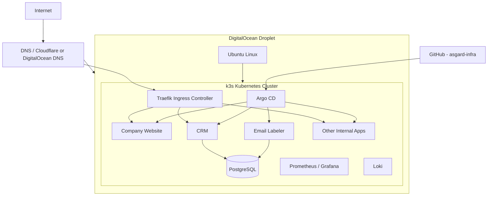
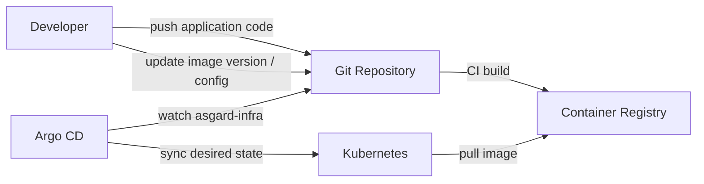

# Asgard Infrastructure Guide

This repository documents and manages a small self-hosted company infrastructure built primarily for learning Kubernetes, GitOps, and infrastructure operations.

The goal is **not** to build the simplest possible hosting solution. The goal is to understand how the pieces fit together by building and operating them manually.

---

## Goal

Run several small applications on a single DigitalOcean Droplet:

- Company website
- CRM
- Email labeler / automation services
- Other internal tools
- PostgreSQL
- Monitoring and logging

Use:

- Kubernetes
- k3s
- Argo CD
- GitOps
- Docker
- Helm

---

# Architecture



---

# Request Flow

A normal web request would roughly look like:

```text
User
  ↓
DNS
  ↓
DigitalOcean public IP
  ↓
Traefik / Kubernetes Ingress
  ↓
Kubernetes Service
  ↓
Application Pod
```

For example:

```text
company.com
    ↓
Website Service
    ↓
Website Pod
```

```text
crm.company.com
    ↓
CRM Service
    ↓
CRM Pod
```

---

# Deployment Flow

The infrastructure should eventually follow a GitOps model.



The important idea:

> Git describes what should be running. Kubernetes represents what is currently running. Argo CD keeps the two synchronized.

---

# Technologies to Learn

## 1. Linux

The Kubernetes cluster still runs on a normal Linux machine.

Learn:

- Ubuntu
- SSH
- users and groups
- permissions
- processes
- systemd
- filesystem
- environment variables
- logs
- disk usage
- basic networking
- firewall basics

Useful tools:

```text
ssh
systemctl
journalctl
ps
top / htop
df
du
curl
grep
chmod
chown
ufw
```

You do not need to become a Linux administrator, but you should be comfortable debugging a server.

---

# 2. Networking

Networking is one of the most important areas to understand.

Learn:

- IP addresses
- public vs private IPs
- ports
- TCP
- DNS
- HTTP
- HTTPS
- TLS certificates
- reverse proxies
- NAT
- firewalls

Understand this relationship:

```text
domain
  ↓
DNS
  ↓
server IP
  ↓
port 443
  ↓
Ingress
  ↓
Service
  ↓
Pod
```

---

# 3. Docker

Before Kubernetes, understand containers.

Learn:

- images
- containers
- Dockerfiles
- image layers
- ports
- environment variables
- volumes
- networking
- registries

Be comfortable with this flow:

```text
Application
    ↓
Dockerfile
    ↓
Docker Image
    ↓
Container Registry
    ↓
Kubernetes
```

Possible registries:

- GitHub Container Registry
- DigitalOcean Container Registry
- Docker Hub

---

# 4. Kubernetes

This is the main technology to learn.

Start with these concepts:

## Pod

The smallest runtime unit.

```text
Pod
└── Container
```

## Deployment

Controls application Pods.

```text
Deployment
    ↓
ReplicaSet
    ↓
Pods
```

A Deployment describes things such as:

- container image
- number of replicas
- environment variables
- resource limits
- update strategy

## Service

Provides stable networking to Pods.

```text
Service
   ↓
Pod
Pod
Pod
```

Pods can disappear and be recreated.

The Service provides a stable endpoint.

## Ingress

Routes external HTTP traffic.

```text
crm.company.com
       ↓
Ingress
       ↓
CRM Service
       ↓
CRM Pod
```

## ConfigMap

Stores non-secret configuration.

Examples:

```text
LOG_LEVEL
APP_ENV
API_URL
```

## Secret

Stores sensitive configuration.

Examples:

```text
DATABASE_PASSWORD
API_KEY
JWT_SECRET
```

Learn how Kubernetes Secrets work, but also understand that Kubernetes Secrets are **not automatically strongly encrypted secret storage**.

## PersistentVolume / PersistentVolumeClaim

Used when data must survive Pod recreation.

Important for:

```text
PostgreSQL
uploads
persistent application data
```

Understand:

```text
Pod
 ↓
PersistentVolumeClaim
 ↓
PersistentVolume
 ↓
Disk
```

## Namespace

Logical separation inside a Kubernetes cluster.

Potential structure:

```text
production
monitoring
argocd
```

or:

```text
website
crm
internal-tools
monitoring
```

---

# 5. k3s

k3s is the Kubernetes distribution running on the server.

Think of it as:

```text
Ubuntu
   ↓
k3s
   ↓
Kubernetes
```

Learn:

- what k3s installs
- control plane
- worker node
- Kubernetes API
- kubeconfig
- embedded components
- how k3s differs from kubeadm Kubernetes

You should understand that k3s is still Kubernetes.

---

# 6. kubectl

`kubectl` is the CLI used to interact with Kubernetes.

Conceptually understand operations such as:

```text
inspect resources
inspect Pods
view logs
describe resources
apply manifests
delete resources
port-forward
inspect events
```

When something fails, `kubectl` will be one of your main debugging tools.

---

# 7. YAML

Much of Kubernetes infrastructure is described using YAML.

Example conceptually:

```yaml
apiVersion:
kind:
metadata:
spec:
```

You should become comfortable reading Kubernetes manifests.

Do not focus on memorizing YAML.

Focus on understanding what the Kubernetes objects represent.

---

# 8. Traefik

k3s includes Traefik by default.

Traefik acts as the ingress controller.

It receives requests such as:

```text
crm.company.com
```

and routes them to:

```text
CRM Service
```

Learn:

- ingress controller
- Ingress resources
- host-based routing
- HTTPS termination
- routing rules

---

# 9. TLS / HTTPS

Applications should eventually run over HTTPS.

Learn:

- TLS certificates
- certificate authorities
- Let's Encrypt
- certificate renewal

Potential tooling:

```text
cert-manager
Let's Encrypt
```

Depending on your Traefik setup, TLS management can also be handled through Traefik.

---

# 10. Helm

Helm is essentially a package manager and templating system for Kubernetes.

Instead of manually maintaining many YAML files:

```text
Helm Chart
   ↓
Templates
   ↓
Kubernetes resources
```

Use Helm initially for installing third-party applications such as:

- Argo CD
- Prometheus
- Grafana
- Loki

Later you can decide whether your own applications should also use Helm.

---

# 11. Argo CD

Argo CD introduces GitOps.

Without Argo:

```text
Developer
   ↓
kubectl apply
   ↓
Kubernetes
```

With Argo:

```text
Developer
   ↓
Git
   ↓
Argo CD
   ↓
Kubernetes
```

Learn:

- Argo Applications
- sync
- desired state
- actual state
- drift
- automated synchronization
- health status

The goal is eventually to avoid manually changing production Kubernetes resources.

Changes should happen through Git.

---

# 12. Git / GitHub

Git becomes part of your infrastructure.

Your repository becomes the **source of truth**.

Repository:

```text
asgard-infra
```

---

# Suggested Repository Structure

Do not treat this structure as mandatory.

Start simple and evolve it.

```text
asgard-infra/
│
├── apps/
│   │
│   ├── website/
│   │   ├── deployment.yaml
│   │   ├── service.yaml
│   │   └── ingress.yaml
│   │
│   ├── crm/
│   │   ├── deployment.yaml
│   │   ├── service.yaml
│   │   └── ingress.yaml
│   │
│   └── email-labeler/
│       ├── deployment.yaml
│       └── service.yaml
│
├── infrastructure/
│   │
│   ├── argocd/
│   ├── monitoring/
│   ├── ingress/
│   └── database/
│
├── environments/
│   └── production/
│
└── README.md
```

Later this could evolve into:

```text
apps/
infrastructure/
clusters/
environments/
helm/
```

Do not over-design the repository before understanding why you need the structure.

---

# 13. GitHub Actions

Argo CD and GitHub Actions solve different problems.

### GitHub Actions

Good for:

```text
test
lint
build
Docker build
push image
```

### Argo CD

Good for:

```text
deploy
synchronize Kubernetes
detect configuration drift
```

Typical flow:

```text
Application Code
       ↓
GitHub Actions
       ↓
Docker Image
       ↓
Container Registry
       ↓
Update asgard-infra
       ↓
Argo CD
       ↓
Kubernetes
```

---

# 14. PostgreSQL

The CRM and other applications will probably require persistence.

Learn:

- PostgreSQL basics
- users
- databases
- connection strings
- backups
- restore
- persistent storage

Initially you can run PostgreSQL inside Kubernetes for learning.

However, understand the operational implications of running databases inside Kubernetes.

---

# 15. Kubernetes Storage

Containers should be considered disposable.

Database data cannot be.

Understand:

```text
Pod dies
    ↓
New Pod created
    ↓
Persistent disk remains
```

Learn:

- PersistentVolume
- PersistentVolumeClaim
- StorageClass
- DigitalOcean Block Storage

---

# 16. Backups

A backup is not:

```text
"I have a persistent volume."
```

A persistent volume can also fail.

Think about:

```text
PostgreSQL
   ↓
database backup
   ↓
remote storage
```

Potential destinations:

- DigitalOcean Spaces
- S3-compatible storage
- another machine

Eventually automate backups with Kubernetes CronJobs.

---

# 17. Monitoring

Once several applications are running, introduce:

```text
Prometheus
Grafana
```

Prometheus collects metrics.

Grafana visualizes them.

Monitor things such as:

```text
CPU
memory
disk
Pod health
request rates
application metrics
database metrics
```

---

# 18. Logging

Eventually add centralized logs.

Potential stack:

```text
Application
    ↓
stdout
    ↓
Loki
    ↓
Grafana
```

Learn Loki after you understand normal Kubernetes logs.

Do not add it immediately.

---

# 19. Security

Security should gradually become part of the project.

## Server

- SSH keys
- disable password SSH
- firewall
- security updates
- least privilege

## Kubernetes

- RBAC
- ServiceAccounts
- namespaces
- resource limits
- network exposure

## Applications

- secrets
- authentication
- HTTPS
- database permissions

---

# 20. Secrets Management

Start by understanding Kubernetes Secrets.

Later investigate tools such as:

```text
Sealed Secrets
External Secrets Operator
SOPS
```

Vault is another option, but it is significantly more complex.

Do not start with Vault.

---

# 21. Terraform

Terraform can eventually manage the infrastructure outside Kubernetes.

For example:

```text
Terraform
   ↓
DigitalOcean
   ├── Droplet
   ├── Firewall
   ├── DNS
   ├── Volumes
   └── Networking
```

Initially create these manually.

Once you understand what you're creating, reproduce them with Terraform.

---

# Recommended Learning Order

## Phase 1 — Server

Learn:

```text
DigitalOcean
Linux
SSH
DNS
Networking
Firewall
```

Goal:

```text
Own and understand your server.
```

## Phase 2 — Containers

Learn:

```text
Docker
Dockerfiles
container registries
```

Goal:

Containerize the company website.

## Phase 3 — Kubernetes

Install k3s.

Learn:

```text
kubectl
Pods
Deployments
Services
Ingress
ConfigMaps
Secrets
Namespaces
```

Goal:

Run the company website through Kubernetes.

## Phase 4 — Networking

Configure:

```text
DNS
Traefik
Ingress
HTTPS
TLS
```

Goal:

```text
https://company.com
```

should resolve to an application running inside Kubernetes.

## Phase 5 — Real Application

Deploy the CRM.

Introduce:

```text
PostgreSQL
Secrets
PersistentVolumes
PersistentVolumeClaims
```

Goal:

Run a stateful application.

## Phase 6 — Helm

Learn Helm by installing existing software.

Good first examples:

```text
Argo CD
Prometheus
Grafana
```

## Phase 7 — GitOps

Install Argo CD.

Move Kubernetes configuration into `asgard-infra`.

Goal:

```text
Git commit
    ↓
Argo CD
    ↓
Kubernetes changes
```

Avoid manually deploying applications after this point.

## Phase 8 — CI

Introduce GitHub Actions.

Goal:

```text
push code
   ↓
tests
   ↓
Docker build
   ↓
push image
   ↓
update asgard-infra
   ↓
Argo CD
   ↓
Kubernetes
```

## Phase 9 — Operations

Add:

```text
monitoring
logging
backups
alerts
resource limits
health checks
```

## Phase 10 — Infrastructure as Code

Introduce Terraform.

Recreate infrastructure such as:

```text
Droplet
DNS
firewall
storage
```

through code.

---

# Concepts Worth Understanding Deeply

Do not just learn which command to run.

Try to understand these questions:

### Containers

> Why can a container disappear without affecting the system?

### Kubernetes

> Why does Kubernetes use Deployments instead of directly creating Pods?

### Services

> Why do Pods need Services if they already have IP addresses?

### Ingress

> What happens between `crm.company.com` and the CRM container?

### Storage

> What happens to PostgreSQL data when its Pod dies?

### GitOps

> What happens if someone manually changes Kubernetes while `asgard-infra` says something different?

### DNS

> How does the browser know which server owns `crm.company.com`?

### TLS

> How does the browser know it is really communicating with your server?

### Monitoring

> How would you know your application is broken before a user tells you?

### Backups

> If the server disappears completely, how do you rebuild everything?

That last question is eventually the ultimate test of the project.

---

# End Goal

Eventually the infrastructure should conceptually look like:

```text
                    GitHub
                      │
          ┌───────────┴───────────┐
          │                       │
    Application Code        asgard-infra
          │                       │
          ↓                       ↓
    GitHub Actions             Argo CD
          │                       │
          ↓                       │
    Container Registry            │
          │                       │
          └───────────┬───────────┘
                      ↓
                Kubernetes
                      │
       ┌──────────────┼──────────────┐
       │              │              │
     Website          CRM       Internal Apps
                      │
                      ↓
                  PostgreSQL
```

Supporting everything:

```text
Traefik
TLS
DNS
Persistent Storage
Prometheus
Grafana
Loki
Backups
```

---

# Things To Deliberately Avoid Initially

There are many interesting Kubernetes technologies that are unnecessary for this project initially.

Avoid adding these just because they exist:

```text
Istio
service meshes
HashiCorp Vault
custom Kubernetes operators
Kafka
multi-region Kubernetes
multi-cluster Kubernetes
complex autoscaling
high-availability control planes
advanced CNI configuration
Kubernetes federation
```

Learn them when you encounter a problem that they actually solve.

---

# First Milestone

The first meaningful milestone should be extremely simple:

```text
DigitalOcean Droplet
       ↓
Ubuntu
       ↓
k3s
       ↓
Deployment
       ↓
Service
       ↓
Ingress
       ↓
Company Website
```

Once this works and you understand **why every component exists**, continue with PostgreSQL, Argo CD, monitoring, CI/CD, and the rest.

The objective is not simply:

> "Make the website work."

The objective is:

> "Understand every layer between a Git commit and a user opening the website."
